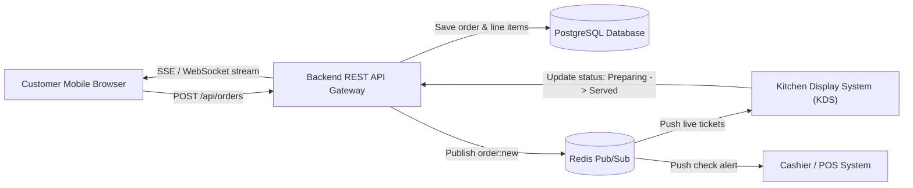

# Backend Architecture & API Specification (RestaurantOS)

> **Document Purpose:** Complete specification of the backend APIs, database schemas, WebSocket/SSE real-time events, and security rules required to support **Phase 1: Customer QR Ordering Web App (Mobile-First)**.

---

## 1. System Overview & Frontend Contract

The customer-facing application is a mobile-first web app accessed by scanning a table QR code (e.g. `/table/T-04` or `/menu?table=T-04`).
The frontend is decoupled and consumes standard JSON REST endpoints and Server-Sent Events (SSE) or WebSockets for live status updates.



---

## 2. API Endpoints Specification

### 2.1 Order Submission

#### `POST /api/orders`
Dispatches a new order from a customer table to the kitchen.

- **Rate Limit:** 5 requests per table per minute.
- **Request Headers:**
  - `Content-Type: application/json`
  - `X-Session-ID: <uuid>` *(optional client session tracker)*

- **Request Body (TypeScript Contract):**
```json
{
  "tableId": "T-04",
  "items": [
    {
      "cartItemId": "burger-anda-shami_[bun_choice:bun_sesame|burger_addons:add_cheese|spice_level:spice_teekha]_[extra mint raita]",
      "item": {
        "id": "burger-anda-shami",
        "name": "Anda Shami Burger",
        "price": 280
      },
      "quantity": 2,
      "selectedModifiers": [
        {
          "groupId": "spice_level",
          "groupName": "Spice Level",
          "optionId": "spice_teekha",
          "optionName": "Teekha (Extra Green Chili & Chaat)",
          "price": 20
        },
        {
          "groupId": "bun_choice",
          "groupName": "Bun & Bread Style",
          "optionId": "bun_sesame",
          "optionName": "Toasted Sesame Bun",
          "price": 0
        },
        {
          "groupId": "burger_addons",
          "groupName": "Add-ons & Extras",
          "optionId": "add_cheese",
          "optionName": "Cheddar Cheese Slice",
          "price": 60
        }
      ],
      "notes": "Extra mint raita, crispy shami",
      "unitPrice": 360,
      "totalPrice": 720
    }
  ],
  "totalAmount": 792,
  "notes": "Serve chai after burgers"
}
```

- **Backend Validation & Processing Rules:**
  1. **Price Verification (CRITICAL):** Never trust `unitPrice` or `totalAmount` from the client. Recalculate each item:
     $$\text{Verified Unit Price} = \text{MenuItem.basePrice} + \sum \text{SelectedModifier.price}$$
     $$\text{Verified Subtotal} = \sum (\text{Verified Unit Price} \times \text{quantity})$$
     $$\text{Verified Total} = \text{Verified Subtotal} + 5\% \text{ Service} + 5\% \text{ GST}$$
  2. If client `totalAmount` differs from backend by more than 1 currency unit, reject with `400 Bad Request (PRICE_MISMATCH)`.
  3. Verify all items exist and are not `isOutOfStock = true`.
  4. Ensure table `T-04` exists in the database.

- **Response `201 Created`:**
```json
{
  "success": true,
  "orderId": "ORD-2575",
  "tableId": "T-04",
  "status": "received",
  "itemsCount": 2,
  "subtotal": 720,
  "serviceCharge": 36,
  "tax": 36,
  "totalAmount": 792,
  "estimatedMinutes": 12,
  "createdAt": 1727452745000,
  "statusHistory": [
    {
      "status": "received",
      "timestamp": 1727452745000,
      "message": "Order received by the cafe kitchen"
    }
  ]
}
```

---

### 2.2 Live Order Status & Real-Time Tracking

#### `GET /api/orders/:orderId`
Retrieves current order details, line items, and current status.

- **Response `200 OK`:**
```json
{
  "orderId": "ORD-2575",
  "tableId": "T-04",
  "status": "preparing",
  "estimatedMinutes": 8,
  "totalAmount": 792,
  "createdAt": 1727452745000,
  "statusHistory": [
    {
      "status": "received",
      "timestamp": 1727452745000,
      "message": "Order received by kitchen"
    },
    {
      "status": "preparing",
      "timestamp": 1727452760000,
      "message": "Chef is cooking your dishes"
    }
  ],
  "items": [...]
}
```

#### `GET /api/orders/:orderId/stream` (Server-Sent Events)
Live push stream for real-time status changes:

- **Headers:**
  - `Content-Type: text/event-stream`
  - `Cache-Control: no-cache`
  - `Connection: keep-alive`
- **Stream Event Example:**
```text
event: status_change
data: {"orderId":"ORD-2575","status":"preparing","estimatedMinutes":8,"message":"Chef started cooking"}

event: status_change
data: {"orderId":"ORD-2575","status":"served","estimatedMinutes":0,"message":"Dishes served at Table 04"}
```

---

### 2.3 Service Actions (Waiter & Bill)

#### `POST /api/service/call-waiter`
Notifies waitstaff and sounds an alert on the server tablet or POS.

- **Anti-Spam Rate Limit:** Maximum 1 request per table every 120 seconds (2 minutes).
  - Implement using Redis key: `waiter_cooldown:table:{tableId}` with TTL 120.
  - If key exists, return `429 Too Many Requests` with `{ error: "COOLDOWN_ACTIVE", remainingSeconds: 84 }`.

- **Request Body:**
```json
{
  "tableId": "T-04",
  "reason": "water",
  "customNote": "Need 2 cold glasses"
}
```

- **Response `200 OK`:**
```json
{
  "success": true,
  "tableId": "T-04",
  "status": "notified",
  "cooldownSeconds": 120,
  "message": "Server notified, someone will be with you shortly"
}
```

- **Response `429 Too Many Requests`:**
```json
{
  "success": false,
  "error": "COOLDOWN_ACTIVE",
  "remainingSeconds": 92,
  "message": "Please wait before calling staff again."
}
```

---

#### `POST /api/service/request-bill`
Alerts POS that customer is ready to settle check.

- **Request Body:**
```json
{
  "tableId": "T-04",
  "paymentMethod": "card",
  "splitCount": 2,
  "customNote": "Need split bill by 2 cards"
}
```

- **Response `200 OK`:**
```json
{
  "success": true,
  "tableId": "T-04",
  "invoiceId": "INV-8910",
  "status": "bill_requested",
  "tableTotal": 792,
  "message": "POS alerted: Table bill requested. A server is printing your check."
}
```

---

### 2.4 Menu Ingestion & Categories

#### `GET /api/menu`
Returns all active categories, menu items, and modifier groups.

- **Cache Header:** `Cache-Control: public, max-age=300, stale-while-revalidate=60`
- **Response Format:**
```json
{
  "restaurant": {
    "name": "Chaska & Chai Cafe",
    "currencySymbol": "Rs. ",
    "serviceChargePercent": 5,
    "taxPercent": 5
  },
  "categories": [...],
  "items": [
    {
      "id": "burger-anda-shami",
      "name": "Anda Shami Burger",
      "price": 280,
      "isOutOfStock": false,
      "modifierGroups": [
        {
          "id": "spice_level",
          "name": "Spice Level",
          "minSelect": 1,
          "maxSelect": 1,
          "required": true,
          "options": [
            { "id": "spice_mild", "name": "Mild", "price": 0, "isDefault": true },
            { "id": "spice_teekha", "name": "Teekha", "price": 20 }
          ]
        }
      ]
    }
  ]
}
```

---

## 3. Database Schema (PostgreSQL / Prisma ORM)

```prisma
datasource db {
  provider = "postgresql"
  url      = env("DATABASE_URL")
}

generator client {
  provider = "prisma-client-js"
}

enum TableStatus {
  AVAILABLE
  OCCUPIED
  BILLING
  RESERVED
}

enum OrderStatus {
  RECEIVED
  PREPARING
  SERVED
  COMPLETED
  CANCELLED
}

enum PaymentMethod {
  CASH
  CARD
  CONTACTLESS
  SPLIT
}

model RestaurantTable {
  id              String           @id @default(uuid())
  tableNumber     String           @unique // e.g. "T-04"
  status          TableStatus      @default(AVAILABLE)
  orders          Order[]
  serviceRequests ServiceRequest[]
  createdAt       DateTime         @default(now())
  updatedAt       DateTime         @updatedAt
}

model MenuItem {
  id              String           @id
  name            String
  description     String
  price           Decimal          @db.Decimal(10, 2)
  image           String
  categoryId      String
  category        Category         @relation(fields: [categoryId], references: [id])
  isVegetarian    Boolean          @default(false)
  isVegan         Boolean          @default(false)
  isGlutenFree    Boolean          @default(false)
  spicyLevel      Int              @default(0)
  isOutOfStock    Boolean          @default(false)
  calories        Int?
  preparationTime String?
  modifierGroups  ModifierGroup[]
  orderItems      OrderItem[]
}

model Category {
  id        String     @id
  name      String
  icon      String
  badge     String?
  items     MenuItem[]
}

model ModifierGroup {
  id          String           @id
  name        String
  description String?
  minSelect   Int              @default(0)
  maxSelect   Int              @default(1)
  required    Boolean          @default(false)
  menuItemId  String
  menuItem    MenuItem         @relation(fields: [menuItemId], references: [id], onDelete: Cascade)
  options     ModifierOption[]
}

model ModifierOption {
  id          String         @id
  name        String
  price       Decimal        @default(0) @db.Decimal(10, 2)
  isDefault   Boolean        @default(false)
  groupId     String
  group       ModifierGroup  @relation(fields: [groupId], references: [id], onDelete: Cascade)
}

model Order {
  id               String           @id @default(cuid()) // e.g. "ORD-2575"
  tableNumber      String
  table            RestaurantTable  @relation(fields: [tableNumber], references: [tableNumber])
  status           OrderStatus      @default(RECEIVED)
  subtotal         Decimal          @db.Decimal(10, 2)
  serviceCharge    Decimal          @db.Decimal(10, 2)
  tax              Decimal          @db.Decimal(10, 2)
  totalAmount      Decimal          @db.Decimal(10, 2)
  notes            String?
  estimatedMinutes Int              @default(12)
  orderItems       OrderItem[]
  statusHistory    OrderStatusLog[]
  createdAt        DateTime         @default(now())
  updatedAt        DateTime         @updatedAt
}

model OrderItem {
  id                String                   @id @default(uuid())
  orderId           String
  order             Order                    @relation(fields: [orderId], references: [id], onDelete: Cascade)
  menuItemId        String
  menuItem          MenuItem                 @relation(fields: [menuItemId], references: [id])
  quantity          Int                      @default(1)
  unitPrice         Decimal                  @db.Decimal(10, 2)
  totalPrice        Decimal                  @db.Decimal(10, 2)
  notes             String?
  selectedModifiers OrderItemModifierOption[]
}

model OrderItemModifierOption {
  id          String    @id @default(uuid())
  orderItemId String
  orderItem   OrderItem @relation(fields: [orderItemId], references: [id], onDelete: Cascade)
  groupName   String
  optionName  String
  price       Decimal   @db.Decimal(10, 2)
}

model OrderStatusLog {
  id        String      @id @default(uuid())
  orderId   String
  order     Order       @relation(fields: [orderId], references: [id], onDelete: Cascade)
  status    OrderStatus
  message   String
  createdAt DateTime    @default(now())
}

model ServiceRequest {
  id            String          @id @default(uuid())
  tableNumber   String
  table         RestaurantTable @relation(fields: [tableNumber], references: [tableNumber])
  type          String          // "call_waiter" | "request_bill"
  reason        String?
  paymentMethod PaymentMethod?
  customNote    String?
  isResolved    Boolean         @default(false)
  createdAt     DateTime        @default(now())
}
```

---

## 4. Webhook / PubSub Event Flow

When an order or service request occurs, publish events to Redis channel `restaurant:events`:

| Event | Publisher | Subscribers | Payload |
| :--- | :--- | :--- | :--- |
| `order:created` | Customer API | KDS, Sound Engine, Cashier | `{ orderId, tableId, items, totalAmount, notes }` |
| `order:status_updated` | Kitchen KDS | Customer SSE, Server Tablet | `{ orderId, tableId, status: "PREPARING" \| "SERVED" }` |
| `waiter:called` | Customer API | Waiter Watches, POS | `{ tableId, reason, note, timestamp }` |
| `bill:requested` | Customer API | POS Terminal, Waiter | `{ tableId, paymentMethod, tableTotal }` |

---

## 5. Security & Verification Checklist for Backend Engineers

1. **Price Tampering:** Ensure unit prices and modifier extra costs are calculated directly from the database, not accepted blindly from the frontend JSON.
2. **Table ID Validation:** Validate that `tableId` maps to a registered physical table.
3. **CORS Whitelist:** Allow requests only from approved customer web domains and localhost for development.
4. **Idempotency:** Include client-provided `orderId` or unique composite key hash to prevent duplicate order placements if network retries happen.
5. **Rate Limiting:** Enforce strict 120-second Redis rate-limiting on `/api/service/call-waiter` to prevent spamming restaurant staff.
